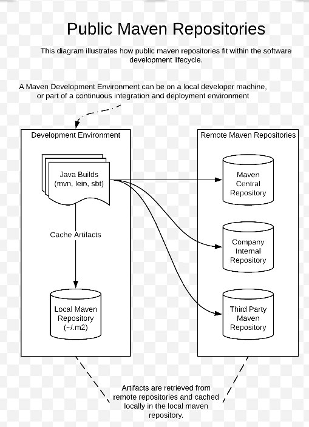

## 스프링 부트 시작하기

⚠️ 본 게시물은 `스프링 부트와 AWS로 혼자 구현하는 웹서비스`를 참고도서로 활용합니다. 저작권은 본 책의 저서에게 있음을 알립니다.

### 스프링 부트 알아가기


먼저 IntelliJ, Java 11, Gradle을 설치하고 프로젝트를 Gradle로 생성했을 때를 기준으로 합니다. 이 책에서 나온 몇가지 컨벤션입니다.

1. 패키지명은 웹사이트의 역순으로 합니다.
    - ex) jungwoo.java.com -> com.java.jungwoo
2. 테스트 코드도 기존 패키지와 구성을 같게 합니다
    - ex) 실제 클래스 명이 jungwoo.java.com의 Function이면 test 패키지에서도 jungwoo.java.com의 FunctionTest로 정의합니다.

build.gradle의 구성요소도 확인해보겠습니다.

1. plugins : 스프링 부트 의존성 관리와 어플리케이션 패키징을 도와주는 도구.
2. group : 프로젝트를 정의하는 고유 식별자 정보
3. version : 현재 프로젝트의 버전(snapshot이 붙을 경우 개발이 완료되지 않은 상황)
4. sourceCompatibility[^1] : 컴파일에서 사용하는 JDK 버전입니다.
    - 실수로 더 높은 버전의 java 기능을 사용하는 것을 방지합니다.
    - `targetCompatibility`라는 기능도 있습니다.(직접 추가해야함)
        - 생성된 클래스 파일의 버전을 제어합니다.
        - 프로그램에서 실행할 수 있는 `가장 낮은 java 버전`을 말합니다.
5. rerpositories[^2] : 프로젝트의 저장소를 구성합니다.\
 라이브러리를 어떤 원격 저장소에서 받을지를 결정합니다.
    - mavenCentral : 기존에 많이 쓰인 저장소, 직접 만든 라이브러리를 업로드 어려움
    - jcenter : mavenCentral의 단점을 개선한 저장소
1. test : Test task를 추가, 본 프로젝트에서는 JUnit을 사용하기 때문에 `useJUnitPlatform()`을 사용한다.
2. dependencies : 프로젝트 개발에 필요한 의존성들을 선언하는 곳.
    - 주의할 점은 어떠한 버전에 종속적인 의존성을 선언하는 것을 지양해야 합니다.
3. implementation[^3] : 의존 라이브러리 수정시 본 모듈까지만 리빌드한다.
    - testImplementation : 테스트 코드를 수행할 때만 적용
    - runtimeOnly : runtime 시에만 필요한 라이브러리일 경우
    - compileOnly : 컴파일 시에만 빌드하고 빌드 결과물에는 포함하지 않는다.
    - annotationProcessor : annotation processor 명시한다.

implementation 추가 설명 :\
A <- B <- C 의 의존관계를 가진다고 가정해보자.

- compile은 A 수정시 B,C 등 의존 오브젝트가 모두 다시 빌드되어야 한다.
- implementation은 A 수정시 B만 다시 빌드하면 된다.

gradle 3.0 이상부터는 compile 사용을 권하지 않는다.

artifact란?\
spring에서는 보통 `jar`파일, 빌드 결과물을 말한다.

jar 파일이란?\
`Java Archive`를 뜻한다. 여러개의 자바 클래스 파일과 클래스들이 이용하는 리소스(텍스트, 그림) 및 메타데이터(데이터를 설명하는 데이터)를 하나의 파일로 모아 자바 플랫폼에서 `응용 소프트웨어` 또는 `라이브러리`를 `배포하기 위한` 소프트웨어 `패키지 파일 포맷`이다. - wiki 정의

Maven 저장소[^4]는 일반적으로 maven artifacts가 저장되고 관리되는 공간이다.\
한번 maven artifact가 maven 저장소에 등록되면 다른 maven 프로젝에서 검색, 포함될 수 있다. 



org.springframework.boot 란?\
위에서 언급한 스프링부트의 groupId이다.
-  boot-starter란? : 라이브러리간 의존성, 버전 조합을 미리 정의해서 제공
    - 모든 경우에 대한 완벽한 조합은 아니지만 자주 사용하는 라이브러리에 한에서는 안정적인 사용이 가능하다.

### 한글 깨짐 현상
처음으로 인텔리제이를 사용하면 한글이 제대로 출력되지 않는 현상이 나타난다.
```
Help -> Edit Custom VM Options
vmoption파일에 
-----------------------
-Dfile.encoding=UTF-8
-Dconsole.encoding=UTF-8
-----------------------
을 추가하고 다시 실행한다.
```
### 어노테이션 정리
@RestController
- 컨트롤러를 JSON으로 변환하는 컨트롤러로 만들어준다.
- @ResponseBody를 각 메소드마다 선언했던 것을 한번에 사용할 수 있다고 생각하면 된다.

@GetMapping
- HTTP Method인 Get 요청을 받을 수 있는 API로 만들어 준다.
- 레거시의 @RequestMapping(method = RequestMethod.GET)의 기능을 생각하면 된다.

@ExtendWith(SpringExtension.class)
- 테스트를 진행할 때 JUnit에 내장된 실행자 외에 다른 실행자를 실행
- 여기서는 SpringExtension 스프링 실행자를 사용
- 스프링 부트 테스트와 JUnit사이의 연결자 역할

@WebMvcTest
- 여러 스프링 테스트 어노테이션 중 Web에 집중할 수 있는 어노테이션
- @Controller, @ControllerAdvice를 사용가능
- @Service, @Component, @Repository등은 사용할 수 없다

@Autowired
- 스프링이 관리하는 Bean을 주입받는다.

MockMvc
- Mock(가짜의), 웹 API를 테스트할 때 사용한다.
- 스프링 MVC 테스트의 시작점
- 이 클래스로 HTTP GET, POST등 API 테스트가 가능하다.

mvc.perform(get("/hello"))
- MockMvc를 통해 /hello 주소로 GET 요청을 보낸다.
- 체이닝이 지원되어 아래와 같이 여러 검증 기능을 이어서 선언 가능하다.

- andExpect(status().isOk())
    - mvc.perform의 결과를 검증한다.
    - HTTP Header의 status를 검증한다.
    - 200, 404, 500 등의 상태를 검증
- andExpect(content().string(hello))
    - mvc.perform의 결과를 검증
    - 응답 본문의 내용을 검증한다.

@Getter
- 선언된 모든 필드의 get 메소드를 생성

@RequiredArgsConstructor
- 선언된 모든 final 필드가 포함된 생성자를 생성
- final이 없는 필드는 생성자에 포함되지 않는다.

assertThat
- assertJ라는 테스트 검정 라이브러리

isEqualTo 
- assertJ의 동등 비교 메소드


[^1]:https://dlee0129.tistory.com/265
[^2]:https://pgnt.tistory.com/134
[^3]:https://cantcoding.tistory.com/59
[^4]:https://www.cloudrepo.io/articles/what-is-a-maven-repository.html#overview
