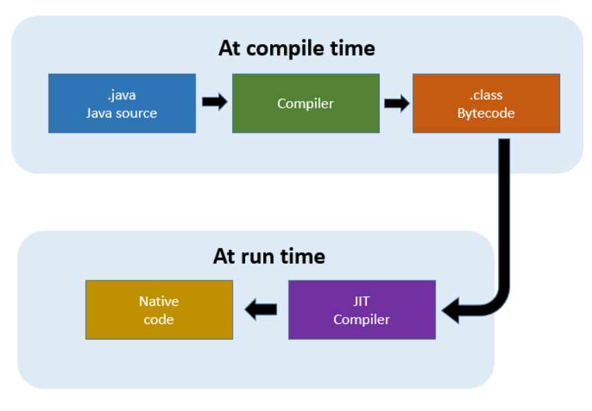

## JVM 개요
Java를 공부하며 많이 들어본 JVM, JVM은 무엇이고 어떻게 컴퓨터에 Java 프로그램을 실행시키는 것일까?

JVM은 가상 머신이며 java 프로그램을 실행시키기 위한 `런타임`을 제공한다.
> 런타임 : 컴퓨터 프로그램이 실행되고 있는 동안의 동작 - wikipedia

Java 소스코드는 CPU가 인식하지 못하므로 기계어가 컴파일을 해야한다.

1. Java는 JVM을 거쳐 OS에 도달하기 때문에 `Java bytecode`인 .class 파일로 변환된다.
    - java는 Managed Code이기 때문이다.
3. bytecode(class)파일은 기계어가 아니기 때문에 OS에서 바로 실행되지 않는다.
   - JVM이 OS가 bytecode를 이해할 수 있도록 해석해준다.
   - 위와 같은 과정이 Java가 OS에 종속적이지 않은 특징을 만든다.

## JVM의 구성 요소
- Class Loader : JVM으로 클래스를 로드하는 역할, bytecode 검증과 Java security model에 위반 되는지 확인한다.
  - bytecode가 있어야 프로그램을 실행하니까 class를 load 한다.
  - Java 보안 모델 : JVM이 무결성을 잃지 않고 클래스를 실행할 수 있도록 보장하는 모델
- Execution Engine : bytecode 명령어를 실행하는 책임이 있고 `interpreter`를 포함한다.(bytecode 명령어를 한 줄씩 해석), JIT 컴파일러가 존재.
  - JIT 컴파일러 : 바이트 코드를 컴퓨터 프로세서가 처리할 수 있는 명령어로 바꾸는 컴파일러
  - interpreter가 명령어로 해석하면 JIT가 바로 기계어로 컴파일하여 실행 속도를 높인다.
    - 자주 사용되는 부분만 컴파일하여 속도를 높인다.
- Memory Management : 프로그램의 객체와 변수에 대한 할당과 해제를 한다. 
- Thread Support : 다중 스레드가 실행할 수 있다.
- Native Interface : Java 프로그램이 Native Code를 호출하거나 Native Code가 Java 프로그램을 호출할 수 있게 도와준다.
  - Native Code : 컴퓨터 기계어로 동작하는 코드, OS에 의해 직접적으로 컴파일 되는 코드. 컴퓨터에서 작성된 그대로 동작한다. ex) C언어
  - Managed Code : Native 코드와 반대, 구동시키기 위해서 인터프리터라는 다른 프로그램이 요구된다. ex) Java
    - 다른 언어로 작성된 라이브러리를 생각하면 된다.
- Security Manager : 위에서 언급한 Java 보안 모델을 통해 검사하는 역할.
## JIT와 interpreter의 차이
Execution Engine에서 인터프리터와 JIT 컴파일러는 bytecode를 해석하는 면에서 차이가 없어 보인다. 두 비슷해 보이는 기능 사이에 어떤 차이가 존재할까?

> interpreter는 bytecode를 바로 실행시키는 반면 JIT 컴파일러는 byte코드를 기계어로 번역한다.

위와 같은 차이로 JIT 컴파일러가 기계어로 번역한 것이 상대적으로빠르고 interpreter로 번역하며 실행하는 것이 상대적으로 느리다.

***그러면 JIT 컴파일러로 bytecode를 번역해서 사용하면 속도도 빠르고 좋은데?***

그럼에도 불구하고 현재까지도 interpreter가 대부분의 실행을 담당하고 JIT 컴파일러는 실행 코드를 분석하고 기계어로 번역해 성능을 올리고 있다.

## JVM이 프로그램을 실행시키는 과정

1. JVM은 메모리에 프로그램을 먼저 로드한다.
   - 이후 bytecode에 에러가 있는지 확인하고 검증한다.
   - 또한 JVM은 프로그램의 객체와 변수에 대한 메모리를 할당한다.(Heap)
2. JVM이 bytecode 명령어를 프로그램의 main 메소드와 함께 실행한다.
   - 프로그램이 실행되면 JVM은 프로그램의 메모리와 리소스를 관리한다.
     - 현재 실행중인 객체, 스레드에 대한 메모리, 리소스 등

## Garbage Collector
JVM의 구성요소 중 memory management는 `가비지 컬렉터`와 매우 유사하다는 것을 알 수 있다.

가비지 컬렉터 : 자동으로 프로그램에서 더 이상 사용하지 않는 메모리를 해제하는 역할, 메모리 누수와 효울적인 작동을 도와준다.