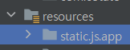
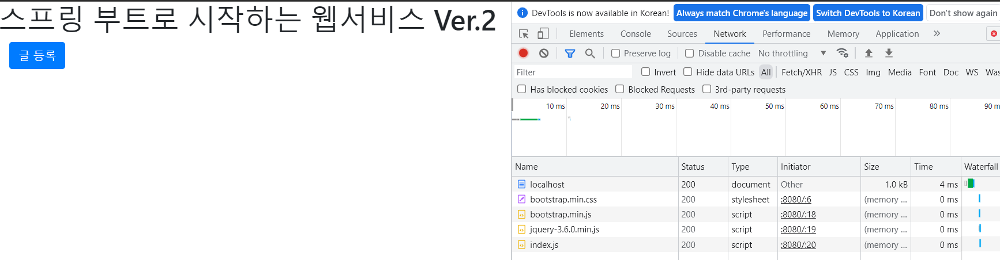

⚠️ 본 게시물은 `스프링 부트와 AWS로 혼자 구현하는 웹서비스`를 참고도서로 활용합니다. 저작권은 본 책의 저서에게 있음을 알립니다.

## 4장 화면 구성하기

본 책에서는 머스테치로 화면구성을 하지만 아래와 같은 단점으로 타임리프를 사용해보기로 하였습니다.

- 머스테치는 `템플릿 언어`이고, 템플릿에서 데이터를 처리하는 기능이 제한적이기 때문에 데이터 처리를 위해서는 코드를 추가로 작성해야 합니다.
- 타임리프는 `템플릿 엔진`이고, `템플릿 언어`보다는 복잡한 데이터 처리가 가능하지만 문법이 상대적으로 어렵습니다.

```
📌타임리프는 문법이 상대적으로 어렵더라도 보편적으로 많이 쓰이고 데이터 처리가 용이하기 때문에 머스테치에서 타임리프로 변경하여 사용하기로 했습니다.
```
### 기존의 화면 구성
본 책에서는 머스테치로 화면 구성을 합니다.

header + 본문 + footer로 화면에서 반복적으로 쓰이는 부분을 header, footer로 따로 정의합니다.

> HTML은 위에서부터 코드가 실행되기 때문에 css를 header에 js를 footer에 둡니다.
>> 이러한 구성은 페이지 로딩 속도를 높입니다.

머스테치는 템플릿 언어이기 때문에 header와 footer를 정의하고 그 내용 그대로 반영이 됩니다. 

*즉 HTML에서 본문을 제외한 윗 부분과 아랫 부분을 그대로 mustache파일로 만듭니다.*
```html
<!DOCTYPE HTML>
<html>
<head>
    <title>스프링 부트 웹서비스</title>
<body>
```
```html
</body>
</html>
```
이렇게 두 소스코드를 각각 header.mustache, footer.mustache로 정의하고
```html
{{>layout/header}}
본문내용                
{{>layout/footer}}
```
위와 같이 화면을 작성합니다.

{{>}}는 현재 파일을 기준으로 다른 파일을 가져옵니다, 현재 파일이 resource/templates에 존재한다면\
{{>layout/header}}는 resource/templates/layout/header.mustache입니다.
> 파일 타입은 mustache를 사용하기 때문에 자동으로 header.mustache를 인식합니다.

하지만 thymeleaf는 fragment를 사용하여 기능을 분리합니다.

```html
<th:block th:fragment="fragment-header">
    <title>스프링 부트 웹 서비스</title>
    <link rel="stylesheet" href="https://stackpath.bootstrapcdn.com/bootstrap/4.3.1/css/bootstrap.min.css">
</th:block>
```
thymeleaf를 사용한 header입니다.
1. 타임리프에서 사용하는 문법인 th:block으로 영역을 지정하고 
2. th:fragment를 통해 다른 파일에서 호출 할 수 있게 하였습니다.
3. 위에서 언급한 이유로 css만 호출하였습니다.
```html
<th:block th:fragment="fragment-footer">
    <script src="https://stackpath.bootstrapcdn.com/bootstrap/4.3.1/js/bootstrap.min.js"></script>
    <script src="https://code.jquery.com/jquery-3.6.0.min.js"></script>
    <script type="text/javascript" src="/js/app/index.js"></script>
</th:block>
```
thymeleaf를 사용한 footer입니다. header와 동일한 목적으로 만들었습니다.

그렇다면 위와 같이 만든 fragment는 어떻게 사용할까요?

바로 불러오고 싶은 영역에 `th:replace`를 사용합니다.

예를 들어 
```html
<div th:replace="fragments/footer.html :: fragment-footer"></div>
1. (resource가 루트), fragments 디렉토리 아래의 footer.html파일을 지정합니다.
2. footer.html 파일에서 fragment-footer라고 지정한 영역을 가져옵니다.
```
이제 html과 css파일은 준비가 됐습니다.

### 요청을 보내기 위한 js파일
위와 같이 화면을 구성하는 것은 결국 사용자가 서버에 요청을 하기 위함 입니다.

사용자가 요청을 하기 위한 js파일을 작성해보겠습니다.

```js
var main = {
    init : function (){
        var _this = this;
        $('#btn-save').on('click', function () {
            _this.save();
        });
    },
    save : function(){
        var data = {
            title: $('#title').val(),
            author: $('#author').val(),
            content: $('#content').val(),
        };
        $.ajax({
            type: 'POST',
            url: '/api/v1/posts',
            dataType: 'json',
            contentType:'application/json; charset=utf-8',
            data: JSON.stringify(data)
        }).done(function(){
            alert('글이 등록되었습니다.');
            window.location.href = '/view/';
        }).fail(function (error) {
            alert(JSON.stringify(error));
        });
    }
};
main.init();
```
위와 같이 js파일을 작성했습니다.



위와 같은 패키지 요구사항이 있다면 `IntelliJ`에서 어떻게 패키지 생성을 하시겠나요?
```
1. static/js/app
2. static.js.app
```
저같은 경우 2번으로 패키지를 작성하여 404에러를 경험하였습니다.

패키지 생성과 표기를 다시 확인하는 작업이 얼마나 중요한지를 다시 한번 깨닫았습니다.


위와 같이 정상적으로 파일이 전송되는 것을 확인할 수 있습니다.